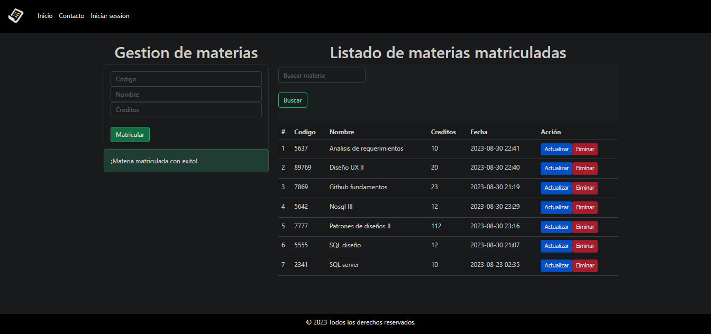
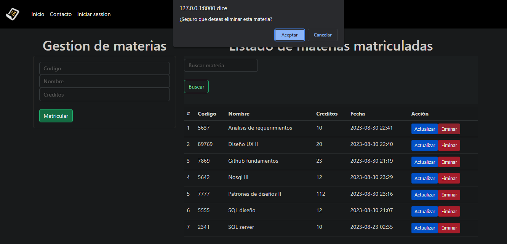
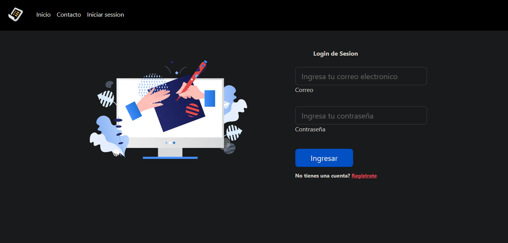
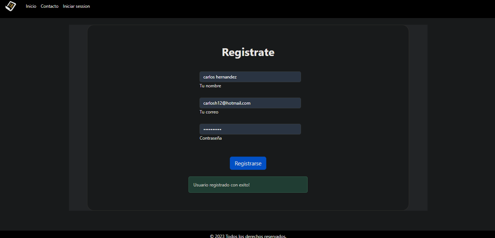
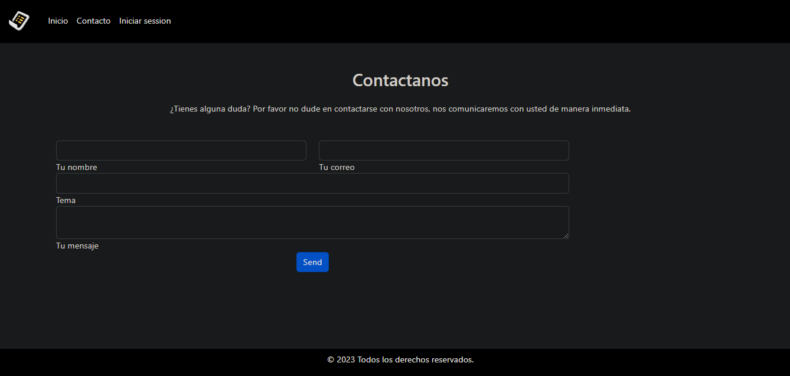

# Sistema de gestion de materias 

App web para la gestion y administracion de materias de una universidad en la que se lleva a cabo operaciones CRUD, cuenta con un logion de sesion.

## Tecnologías usadas

 ● Python versión 3.8.5
 
 ● Framework Django versión 4.2.4
 
 ● CSS y Bootstrap

 ● SQLite

## Instalación
1. Clona este repositorio: `https://github.com/AndresSilverall/sistema-gestion-de-materias.git`
2. Navega a la carpeta del proyecto: `cd mi-proyecto`
3. Ejecuta el servidor de desarrollo: `python manage.py runserver`
4. Abre tu navegador y ve a: `http://127.0.0.1:8000/`
   

## Capturas

### Eventos

### Login

### Registro

### Contacto

